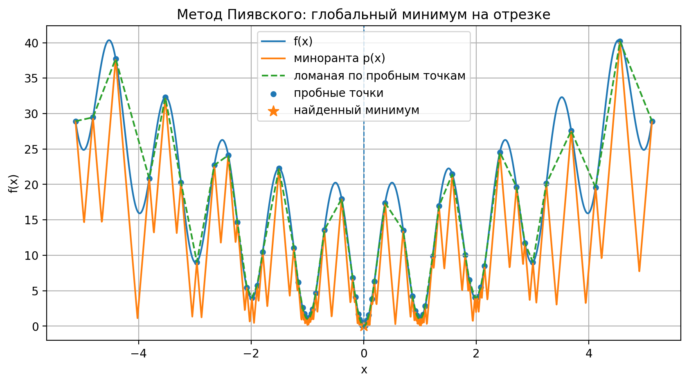

# Поиск глобального минимума липшицевой функции (метод Пиявского)

## Общие сведения

**Ф.И.О.:** Прель Александр Сергеевич 
**Поток:** МЕТОПТ 1.1

В работе реализован поиск **глобального минимума** липшицевой одномерной функции на отрезке с заданной точностью `eps`.  
Используется метод Пиявского, строящий миноранту функции в виде ломаной.  
Программа принимает функцию в виде строки, границы отрезка и точность, выводит найденный минимум, число итераций и время работы, а также строит визуализацию.

---

## Постановка задачи

Дано:

- липшицева функция `f(x)`  
- отрезок `[a, b]`  
- точность `eps`

Требуется найти **приближенное** значение:

$$
x^* \approx \arg \min_{x \in [a,b]} f(x), \qquad f(x^*) \approx \min_{x \in [a,b]} f(x)
$$

и построить визуализацию процесса (функция, миноранта/ломаная, найденная точка минимума).

---

## Метод Пиявского

Пусть функция липшицева с константой $L$:

$$
|f(x) - f(y)| \le L |x - y|
$$

Тогда для каждой пробной точки $x_i$ можно построить «конус»:

$$
g_i(x) = f(x_i) - L |x - x_i|
$$

Миноранта функции:

$$
p(x) = \max_i g_i(x)
$$

На каждом интервале $[x_i, x_{i+1}]$ минимум миноранты достигается в точке пересечения двух конусов:

$$
x^* = \frac{x_i + x_{i+1}}{2} + \frac{f(x_i) - f(x_{i+1})}{2L}
$$

Значение нижней оценки:

$$
p^* = \frac{f(x_i) + f(x_{i+1})}{2} - \frac{L}{2}(x_{i+1} - x_i)
$$

Критерий остановки:

$$
f_{\min} - p_{\min} < \varepsilon
$$

---

## Краткое описание алгоритма (псевдокод)

```
Инициализация: x0 = a, x1 = b
Вычислить f(x0), f(x1)
Оценить L (если не задана)

Пока f_best - p_min > eps:
    Для каждого интервала [x_i, x_{i+1}]:
        Вычислить x* и p* (минимум миноранты на интервале)
    Выбрать интервал с минимальным p*
    Добавить новую точку x* в список проб
    Обновить f_best
```

---

## Реализация

Файл с кодом: `main.py`  


---

## Демонстрация (тестовая функция)

Использована одномерная функция Растригина (имеет много локальных минимумов):

$$
f(x) = 10 + x^2 - 10\cos(2\pi x)
$$

Отрезок: $[-5.12, 5.12]$

---

## Результаты (демонстрация)

Запуск:

```bash
python main.py --expr "10 + x*x - 10*cos(2*pi*x)" --a -5.12 --b 5.12 --eps 0.01 --no-plot
```

Получено:

- $x^* \approx 0.000000$  
- $f(x^*) \approx 0.000000$  
- итераций: **210**  
- точек (проб): **211**  
- время: **~0.013 сек** (зависит от ПК)  
- критерий: $f_{best} - p_{min} \approx 0.009962 < 0.01$  

---

## Графики

Визуализация (функция, миноранта, ломаная по пробным точкам и найденный минимум):



PDF‑отчет с графиком и числовыми результатами: `demo_report.pdf`

---

## Как запустить

Пример запуска (демонстрация Растригина):

```bash
python main.py --expr "10 + x*x - 10*cos(2*pi*x)" --a -5.12 --b 5.12 --eps 0.01
```

Если нужно построение графиков и PDF, установите зависимости:

```bash
pip install -r requirements.txt
```

Интерактивный режим:

```bash
python main.py --interactive
```

---

## Приложения

Файлы визуализации формируются при наличии `numpy` и `matplotlib`:

- PDF‑отчет: `demo_report.pdf`
- PNG‑визуализация: `demo_plot.png`


