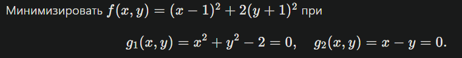

# Лабораторная работа 3 — Метод множителей Лагранжа

## Общие сведения

**Ф.И.О.:** Прель Александр Сергеевич  \
**Группа:** МЕТОПТ 1.1

---

## Вариант задания

### Скрин варианта



### Запись задания

Минимизировать функцию:

`f(x, y) = (x - 1)^2 + 2(y + 1)^2`

при ограничениях:

```
g1(x, y) = x^2 + y^2 - 2 = 0
g2(x, y) = x - y = 0
```

Решить задачу с помощью **метода множителей Лагранжа** и определить характер найденных точек с использованием **критерия Сильвестра**.

---

## Шаблон промпта для БЯМ

```text
Ниже приведена задача условной оптимизации, которую требуется решить с помощью метода множителей Лагранжа. Она записана в Markdown формате. Пожалуйста идентифицируй задачу и реши ее с помощью метода множителей Лагранжа. Проверь характер найденных точек с помощью критерия Сильвестра.
```

---

## Решение методом множителей Лагранжа

### 1) Лагранжиан

Вводим множители Лагранжа `λ1, λ2`:

`L(x, y, λ1, λ2) = (x - 1)^2 + 2(y + 1)^2 + λ1(x^2 + y^2 - 2) + λ2(x - y)`

### 2) Необходимые условия

```
∂L/∂x = 2(x - 1) + 2λ1·x + λ2 = 0
∂L/∂y = 4(y + 1) + 2λ1·y - λ2 = 0
∂L/∂λ1 = x^2 + y^2 - 2 = 0
∂L/∂λ2 = x - y = 0
```

Из ограничения `x - y = 0` получаем:

`x = y`

Подставляем в окружность:

`x^2 + x^2 = 2  ⇒  2x^2 = 2  ⇒  x^2 = 1`

Следовательно:

`x = ±1, y = ±1`

Кандидаты:

`(1, 1), (-1, -1)`

### 3) Значения целевой функции

`f(1, 1) = (1 - 1)^2 + 2(1 + 1)^2 = 8`

`f(-1, -1) = (-2)^2 + 2(0)^2 = 4`

**Меньшее значение достигается в точке (-1, -1).**

---

## Проверка критерием Сильвестра

Матрица Гессе целевой функции:

```
H = [ 2  0
      0  4 ]
```

Главные миноры:

`Δ1 = 2 > 0,  Δ2 = 2·4 = 8 > 0`

Матрица положительно определена ⇒ точка соответствует минимуму.

---

## Итог

Условный минимум достигается в точке:

`(x, y) = (-1, -1)`

Минимальное значение:

`f_min = 4`

---

## Ответ БЯМ (сгенерированный)

> Была составлена функция Лагранжа, найдены частные производные и получена система уравнений. Из ограничений следует, что x = y, подстановка в уравнение окружности даёт точки (1,1) и (-1,-1). Сравнение значений функции показывает, что минимум достигается в точке (-1,-1). Матрица Гессе положительно определена, следовательно, найденная точка является точкой минимума.

---

## Комментарии к ответу БЯМ

- Функция Лагранжа составлена корректно.
- Необходимые условия выписаны верно; из ограничений правильно получено `x = y` и точки `(1,1)`, `(-1,-1)`.
- Значения целевой функции вычислены корректно; сравнение даёт минимум в `(-1,-1)`.
- Критерий Сильвестра применён к Гессе `f`; это упрощение для задачи с двумя равенствами в `R^2` (множество допустимых точек дискретно), но вывод о минимуме остаётся верным.

---

## Рефлективное заключение

В ходе выполнения лабораторной работы был изучен и применён метод множителей Лагранжа для решения задачи условной оптимизации с несколькими ограничениями. Особое внимание было уделено проверке характера найденных точек с помощью критерия Сильвестра, что позволило убедиться, что найденная точка действительно является точкой условного минимума.

Использование большой языковой модели упростило процесс вывода системы уравнений, однако для полной уверенности в результате потребовалась самостоятельная проверка всех вычислений и теоретических условий.
